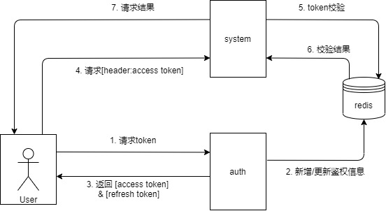

1. 系统请求流程图

   

2. redis存在信息

   | key           | value         |
   | ------------- | ------------- |
   | access token  | refresh token |
   | refresh token | user info     |

3. auth功能

   - 请求token
   - 刷新token
   - 获取用户信息
   - 注册
   - 更新用户信息
   - 安全退出
   - 获取用户权限
   - 获取验证码